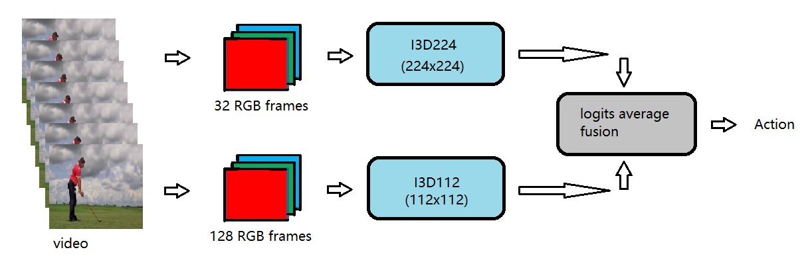

# I3D_Light

A light version of the two-stream I3D model which uses a lower resolution video (spatial resolution = 112x112 compared to 224x224) of a longer temporal range (temporal range = 128 frames compared to 32 frames) RGB branch to capture the motion features. <br>
<br>
This code is based on Miracleyoo's [Trainable-i3d-pytorch](https://github.com/miracleyoo/Trainable-i3d-pytorch)
<br><br>

&nbsp;           &nbsp;Figure 1: Architecture of proposed two-stream I3D Light.

<br><br>

## Setup

```shell
git clone https://github.com/Ruikang07/I3D_Light.git
cd i3d_light

conda create --name i3d_light python=3.7
conda activate i3d_light
pip install -r requirements.txt
```

## Sub-epoch and Sub-dataset
Since the dataset Kinetics400 is very big, each training epoch takes about a few hours. In order to check the effect of hyper-parameters optimization and avoid wasting too much time with wrong hyper-parameters, we use sub-epoch-based training instead of ordinary epoch-based training. The details of the sub-epoch runners are as follows.

### Sub-epoch runner

Step 1: Loading and preprocessing data. <br>
1)	Load training dataset and validation dataset.<br>
2)	Divide the whole training dataset into N (such as 10) subsets randomly with equal probability. Keep validation dataset undivided. <br>
3)	Create N sub-data-loaders corresponding to the N sub-datasets for training and one data loader for validation dataset. <br><br>

Step 2: Training. <br>
1)	Divide one epoch into N sub-epochs. Each sub-epoch performs a training on the corresponding sub-dataset and a validation on the whole validation dataset. <br>
2)	If the validation accuracy is not improved after a specified number of training epochs, the learning rate is updated based on a given schedule and model weights are set to the values which produced the best validation accuracy until that time point.<br><br>

Step 3: Stop the training if epoch number reaches a specified value or early stop condition is satisfied. Otherwise go back to Step 2.<br><br>

In order to save the time of creating sub-datasets, the information of sub-datasets can be saved in json files.<br><br>


## Dataset Folder Structure

```
dataset_in_imgs
├── classes.txt
├── train
│   ├── action1
│   │   ├── video1
│   │   │       ├── img1.png
│   │   │       ├── img2.png
│   │   │       └── ...
│   │   ├── video2
│   │   │       ├── img1.png
│   │   │       ├── img2.png
│   │   │       └── ...
│   │   └── ...
│   ├── action2
│   │   ├── video1
│   │   │       ├── img1.png
│   │   │       ├── img2.png
│   │   │       └── ...
│   │   ├── video2
│   │   │       ├── img1.png
│   │   │       ├── img2.png
│   │   │       └── img ...
│   │   └── ...
│   └── ...
│
├── val
│   ├── action1
│   │   ├── video1
│   │   │       ├── img1.png
│   │   │       ├── img2.png
│   │   │       └── ...
│   │   ├── video2
│   │   │       ├── img1.png
│   │   │       ├── img2.png
│   │   │       └── ...
│   │   └── ...
│   ├── action2
│   │   ├── video1
│   │   │       ├── img1.png
│   │   │       ├── img2.png
│   │   │       └── ...
│   │   ├── video2
│   │   │       ├── img1.png
│   │   │       ├── img2.png
│   │   │       └── img ...
│   │   └── ...
│   └── ...
│
└── json_file_dir
```
<br><br>

## lr scheduler
For simplicity and flexibility, we a list of oredefined lr values as a lr scheduler.
